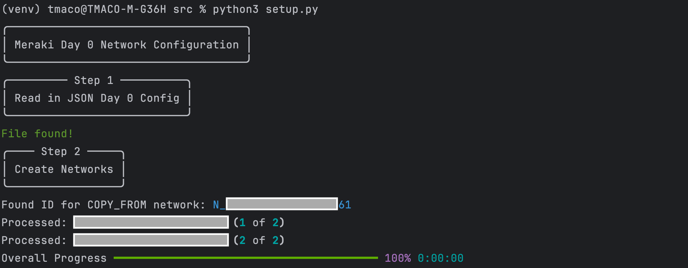
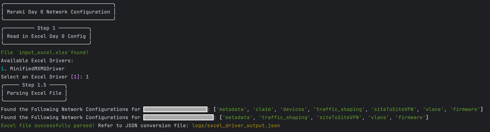
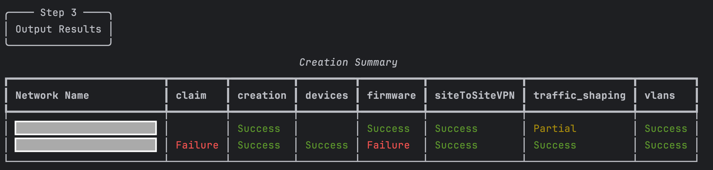
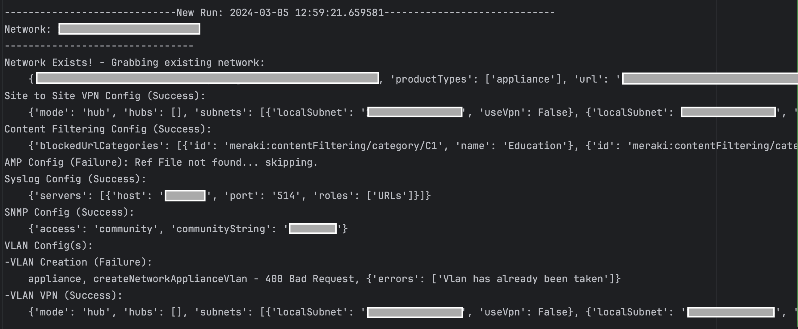

# Meraki Org Day 0 Network Setup

This script creates (or modifies) Meraki networks with a provided `JSON` or `Excel` configuration file. The script makes it much easier to create a large amount of networks with specified configurations at scale.
The script expects a JSON or Excel file structured in a specific format (see `JSON File Structure` or `Excel File Structure` section respectively).

Supported Settings Include:
* Network Creation
* Claim Devices into Network (must be present and unclaimed in inventory!)
* Firmware Upgrades
* Update Device (address, tags, etc.)
* VLAN Creation (VPN, DHCP configurations: `_vpn`, `_dhcp`)
* MX Per Port VLAN Settings
* Site to Site VPN Configuration
* Threat Protection Configurations (AMP)
* Content Filtering Configurations
* SNMP Configurations
* Syslog Configurations
* SD-WAN Traffic Shaping (Uplink Bandwidth: `_uplink_bandwidth`)

## Contacts
* Trevor Maco

## Solution Components
* Meraki

## Prerequisites
### Meraki API Keys
In order to use the Meraki API, you need to enable the API for your organization first. After enabling API access, you can generate an API key. Follow these instructions to enable API access and generate an API key:
1. Login to the Meraki dashboard
2. In the left-hand menu, navigate to `Organization > Settings > Dashboard API access`
3. Click on `Enable access to the Cisco Meraki Dashboard API`
4. Go to `My Profile > API access`
5. Under API access, click on `Generate API key`
6. Save the API key in a safe place. The API key will only be shown once for security purposes, so it is very important to take note of the key then. In case you lose the key, then you have to revoke the key and a generate a new key. Moreover, there is a limit of only two API keys per profile.

> For more information on how to generate an API key, please click [here](https://developer.cisco.com/meraki/api-v1/#!authorization/authorization). 

> Note: You can add your account as Full Organization Admin to your organizations by following the instructions [here](https://documentation.meraki.com/General_Administration/Managing_Dashboard_Access/Managing_Dashboard_Administrators_and_Permissions).

### Docker
This app provides a `Docker` file for easy deployment. If using `Docker`, install `Docker` [here](https://docs.docker.com/get-docker/).

### Excel File Structure
This code leverages `Excel Drivers`, essentially custom, developer defined _Excel Parsers_, to parse Excel Configurations into their corresponding JSON format. `Excel Drivers` allow maximum flexibility and customization for understanding any format of Excel file. 

Ultimately, the output of an Excel Driver is the corresponding JSON configuration, so the output is subject to the same methodology and restrictions seen in the `JSON File Structure` section. It's recommended to review this section.

For more information on defining `Excel Drivers` as well as an example, refer to the driver [readme](src/drivers/DRIVER.md).

### JSON File Structure
The input JSON file must be in a specific format for the script to successfully configure networks. Begin by referencing the `day0_config_example.json` file. This example file includes all supported configurations at this time.

#### Methodology
In General, there are **3 options** for including configurable settings in the JSON file:
* Copy from Existing Network (recommended for global settings shared across all networks)
* Put settings in the master JSON file
* Reference other JSON files from the master file (modularity, best used for reusable pieces of configuration)

#### Minimum Requirements
At a minimum, your JSON file must include:
* A `networks` list (with _Network Dictionary_ objects)
* _Network Dictionary's_ with the following minimum fields:
  * `metadata`: `name` and `productTypes` are **REQUIRED** (refer to [Network Creation API](https://developer.cisco.com/meraki/api-v1/create-organization-network/) for an explanation of the fields)

#### Individual Settings
All other fields at the same level as "metadata" are considered network level `Settings` fields. One or more Settings can be specified depending on the configuration required.  The code recognizes these fields and configures the respective settings.

`Copy Settings`: To copy settings from an existing network, use the `_name_copyFromNetworkId` field and provide a name for the source Network. Be careful, the newly created networks can't include a product type not in the source network!

`Specify New Settings`: To create new settings, copy any of the `Settings` field names from the example. Within each setting, there are several field options:
* `_*`: Fields that start with a "_" are custom fields (not provided to the API)
  * `_ref`: references another JSON file (**MUST** be in the `/configs` folder). The configuration in the referenced JSON file will be used as the API payload (useful for modularizing config). All other configs will be ignored when specifying a "_ref"! Note: you **CANNOT** use a _ref for partial pieces of the API payload (the _ref must point to a file with the complete payload at each level as expected in the docs). Nested "_refs" are supported!
  * `_vpn`, `_dhcp`, etc.: special fields the code uses for configuring settings related to the parent setting (ex: VLAN DHCP configuration). These must match exactly for the code to process the settings.
  * `_name_*`: denotes fields that take the text version of the ID the API requires (the code will look these names up, ex: Group Policy Name for VLANs, Firmware Version ID from Version Name, etc.)
* `All Remaining Fields`: These fields come from the respective API calls (which can be found linked in `meraki_functions.py` or the API docs). The field names and provided values **MUST** match the API doc specs, because they are provided **as is** to the Meraki API (this includes mandatory fields with a red star).

**Notes**: 
* Refer to the documentation for each API call for a description of which API fields are required. Any missing required fields in the JSON will result in an error visible in the logs.
* Settings are processed **top-down** in the JSON file. Certain settings require other configurations to happen first or be present in a copied network (ex: Enabling/Configuring Site to Site VPN first before enabling VLANs over vpn with "_vpn"). These dependencies generally mirror the Meraki Dashboard or can be found in the API docs.

## Installation/Configuration
1. Clone this repository with `git clone [repository name]`. To find the repository name, click the green `Code` button above the repository files. Then, the dropdown menu will show the https domain name. Click the copy button to the right of the domain name to get the value to replace [repository name] placeholder.
2. Rename the `.env_sample` file to `.env`. Rename `config_sample.py` to `config.py` (in `src` directory).
3. Add `Meraki API key` and `Org ID` (found at the bottom of a Meraki Org Webpage) to `.env`
```dotenv
MERAKI_API_KEY="API key goes here"
ORG_ID="Org ID goes here"
```
4. Specify the name of the `Configuration File` holding network configurations in `config.py` (the file **MUST** be located in `configs` directory). Depending on the file extension (.json, .xlsx), the code will process the file differently:
```python
NETWORKS_JSON_FILE_NAME = "day0_config_example.json"
```
5. Set up a Python virtual environment. Make sure Python 3 is installed in your environment, and if not, you may download Python [here](https://www.python.org/downloads/). Once Python 3 is installed in your environment, you can activate the virtual environment with the instructions found [here](https://docs.python.org/3/tutorial/venv.html).
6. Install the requirements with `pip3 install -r requirements.txt`

## Usage
To run the program, use the command:
```
$ python3 setup.py
```
The code can also be run with docker using:
```
$ docker-compose up -d --build
```

This will read in the `Configuration File`. Depending on the chosen configuration file type, the code will read and process the file differently:

* JSON:

The code will read in the JSON file, and continue processing without further user input.



* Excel:

The code will prompt asking which `Excel Driver` to use for parsing the file. Select the appropriate Excel Driver, then (optionally) enter the name of a `Meraki Network` to clone configuration from.




Once all networks have been processed, a summary table is displayed:



The table shows each network and the completion status for each configuration found in the Configuration File. Possible options include:
* `Success`: Configuration successfully applied to the network
* `Failure`: Configurations were unable to be applied to the network (API Error, Script Error, etc.)
* `Partial`: One or more configurations failed to be applied to the network (used with "list" elements or nested configurations. Ex: a list of VLANs, or DHCP configuration failures on a specific VLAN)
* `<blank>`: No configuration found in the Configuration File

For a detailed log of the entire run (showing error messages, API call results, script failures, etc.), refer to the log file under `/logs`




### LICENSE

Provided under Cisco Sample Code License, for details see [LICENSE](LICENSE.md)

### CODE_OF_CONDUCT

Our code of conduct is available [here](CODE_OF_CONDUCT.md)

### CONTRIBUTING

See our contributing guidelines [here](CONTRIBUTING.md)

#### DISCLAIMER:
<b>Please note:</b> This script is meant for demo purposes only. All tools/ scripts in this repo are released for use "AS IS" without any warranties of any kind, including, but not limited to their installation, use, or performance. Any use of these scripts and tools is at your own risk. There is no guarantee that they have been through thorough testing in a comparable environment and we are not responsible for any damage or data loss incurred with their use.
You are responsible for reviewing and testing any scripts you run thoroughly before use in any non-testing environment.